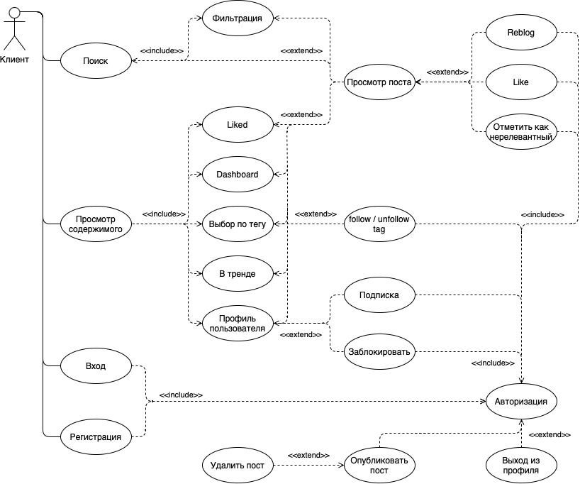
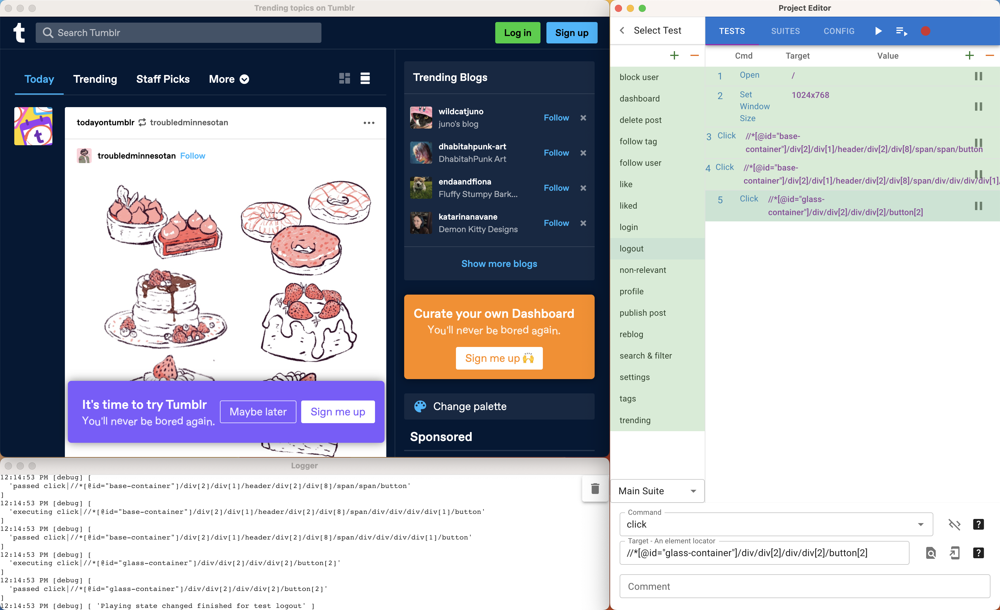

# Лабораторная №3

**Вариант №22352:** Tumblr.com - http://www.tumblr.com/

| Выполнили                    | Группа | Преподаватель   |
| :--------------------------- | ------ | --------------- |
| Яковлев Г. А. Неевин К. | P33111 | Клименков С. В. |

## Цель работы

Сформировать варианты использования, разработать на их основе тестовое покрытие покрытие и провести функциональное тестирование интерфейса сайта (в соответствии с вариантом)

### Требования к выполнению работы

1. Тестовое покрытие должно быть сформировано на основании набора прецедентов использования сайта.
2. Тестирование должно осуществляться автоматически - с помощью системы автоматизированного тестирования Selenium.
3. Шаблоны тестов должны формироваться при помощи Selenium IDE и исполняться при помощи Selenium RC в браузерах Firefox и Chrome.
4. Предполагается, что тестируемый сайт использует динамическую генерацию элементов на странице, т.е. выбор элемента в DOM должен осуществляться не на основании его ID, а с помощью XPath.

## Выполнение

### Use-Case диаграмма

### Тестовое покрытие

| Пользователь | Предикат                                  | Описание                                   | Результат                                                  | Тестирование |
| ------------ | ----------------------------------------- | ------------------------------------------ | ---------------------------------------------------------- | ------------ |
| login        | Нет                                       | Авторизация пользователя по почте и паролю | Авторизация прошла успешно и мы получили токен авторизации | passed       |
| settings     | Пользователь авторизован                  | Настройки пользователя и сайта             | Настройки доступны пользователю                            | passed       |
| pubish post  | Пользователь авторизован                  | Опубликовать пост в своем профиле          | Пост успешно опубликован                                   | passed       |
| delete post  | Пользователь авторизован, пост существует | Удалить пост в своем профиле               | Пост удален                                                | passed       |
| logout       | Пользователь авторизован                  | Выйти из аккаунта пользователя             | Успешный выход из аккаунта                                 | passed       |

| Лента контента  | Предикат                 | Описание                                 | Результат              | Тестирование |
| --------------- | ------------------------ | ---------------------------------------- | ---------------------- | ------------ |
| search & filter | Нет                      | Поиск по запросу и фильтрация результата | Получили список постов | passed       |
| liked           | Пользователь авторизован | Просмотр понравившихся постов            | Получили список постов | passed       |
| dashboard       | Нет                      | Доступность главной страницы сайта       | Получили список постов | passed       |
| tags            | Нет                      | Подборка постов по тегу                  | Получили список постов | passed       |
| trending        | Нет                      | Подборка постов популярных сейчас        | Получили список постов | passed       |

| Блоги        |                          | Описание                                       |                                      | Тестирование |
| ------------ | ------------------------ | ---------------------------------------------- | ------------------------------------ | ------------ |
| non-relevant | Пользователь авторизован | Указать что пост не интересен                  | Рекомендательные алгоритмы изменены  | passed       |
| reblog       | Пользователь авторизован | Ретвит типа на свой профиль                    | Ретвит успешный                      | passed       |
| like         | Пользователь авторизован | Добавить пост в понравившиеся                  | пост добавлен в понравившиеся        | passed       |
| profile      | Нет                      | Перейти в профиль другого пользователя         | Отображение страницы пользователя    | passed       |
| follow user  | Пользователь авторизован | Подписаться на обновления другого пользователя | Успешная подписка на пользователя    | passed       |
| block user   | Пользователь авторизован | Заблокировать другого пользователя             | Пользователь заблокирован            | passed       |
| follow tag   | Пользователь авторизован | Подписаться на обновления тега                 | Успешная подписка на обновления тега | passed       |

### Результат

## Выводы

Мы узнали что такое функциональное тестирование, написали несколько функциональных тестов для проверки Frontend-приложения с помощью Selenium IDE, позанакомились с Xpath и вспомнили use-case диаграммку. 
